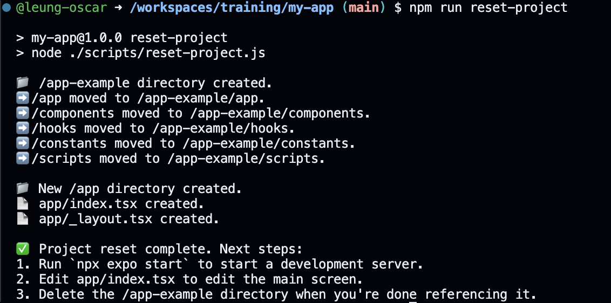

# training

running logs

@leung-oscar ➜ /workspaces/training/my-app (main) $ npm run reset-project

> my-app@1.0.0 reset-project
> node ./scripts/reset-project.js

📁 /app-example directory created.
➡️ /app moved to /app-example/app.
➡️ /components moved to /app-example/components.
➡️ /hooks moved to /app-example/hooks.
➡️ /constants moved to /app-example/constants.
➡️ /scripts moved to /app-example/scripts.

📁 New /app directory created.
📄 app/index.tsx created.
📄 app/_layout.tsx created.

✅ Project reset complete. Next steps:
1. Run `npx expo start` to start a development server.
2. Edit app/index.tsx to edit the main screen.
3. Delete the /app-example directory when you're done referencing it.
